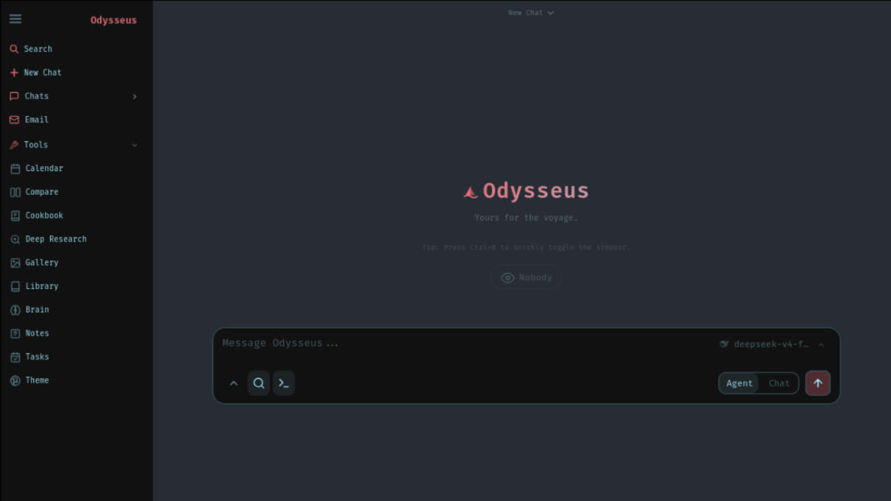

<<<<<<< HEAD
# Misantropic
───────────────────────────────────────────────
 ⊹ ࣪ ˖ ૮( ˶ᵔ ᵕ ᵔ˶ )っ  Misantropic vers. 1.0
───────────────────────────────────────────────



A self-hosted AI workspace -- meant to be the self-hosted version of the UI experience you get from ChatGPT and Claude. But with more jank and fun. Running on your own hardware, with your own data -- local-first, privacy-first, and no trojan.

## Features
  - **Chat** -- chat with any local model or API; adding them is super simple.<br>　<sub>vLLM · llama.cpp · Ollama · OpenRouter · OpenAI</sub>
  - **Agent** -- hand it tools and let it run the whole task itself.<br>　<sub>built on [opencode](https://github.com/anomalyco/opencode) · MCP · web · files · shell · skills · memory</sub>
  - **Cookbook** -- Scans your hardware, recommends models, click to download and serve.. easy!<br>　<sub>built on [llmfit](https://github.com/AlexsJones/llmfit) · VRAM-aware · GGUF / FP8 / AWQ · fit scoring · vLLM / llama.cpp serving</sub>
  - **Deep Research** -- multi-step runs that gather, read, and synthesize sources into a nice visual report.<br>　<sub>adapted from [Tongyi DeepResearch](https://github.com/Alibaba-NLP/DeepResearch)</sub>
  - **Compare** -- a fun tool to compare models side by side. Test completely blind, no bias!<br>　<sub>multi-model · blind test · synthesis</sub>
  - **Documents** -- YOU write the text, AI is there to assist, not the opposite.<br>　<sub>multi-tab editor · markdown · HTML · CSV · syntax highlighting · AI edits · suggestions</sub>
  - **Memory / Skills** -- Persistent memory and skills, your agent evolves over time as it better understands you and your tasks!<br>　<sub>ChromaDB · fastembed (ONNX) · vector + keyword retrieval · import/export</sub>
  - **Email** -- IMAP/SMTP inbox with AI triage built in: urgency reminders, auto-tag, auto-summary, auto-reply drafts, auto-spam.<br>　<sub>IMAP · SMTP · per-account routing · CalDAV-aware</sub>
  - **Notes & Tasks** -- Quick notes with reminders, a todo list, and scheduled tasks the agent can act on.<br>　<sub>note pings · checklist · cron-style tasks · ntfy / browser / email channels</sub>
  - **Calendar** -- Local-first calendar with CalDAV sync to Radicale / Nextcloud / Apple / Fastmail.<br>　<sub>CalDAV pull · .ics import/export · per-calendar colors · agent-aware</sub>
  - **Works on mobile** -- looks and runs great on your phone, not just desktop.<br>　<sub>responsive · installable (PWA) · touch gestures</sub>
  - **Extras** -- more to explore, happy if you give it a go!<br>　<sub>image editor · theme editor · file uploads (vision + PDF) · web search · presets · sessions · 2FA</sub>

## Demo
A full, hover-to-play tour lives on the landing page (`docs/index.html`).

<details>
<summary>Screenshots / clips</summary>

### Chat & Agents

### Deep Research

### Compare

### Documents

### Notes & Tasks


</details>

## Quick Start

Defaults work out of the box: clone, run, then configure models/search/email
inside **Settings**. Only edit `.env` for deployment-level overrides like
`APP_BIND`, `APP_PORT`, `AUTH_ENABLED`, `DATABASE_URL`, or a pre-seeded admin password.

On first setup, Misantropic creates an admin account (`admin` unless
`MISANTROPIC_ADMIN_USER` is set) and prints a temporary password in the terminal.
For Docker installs, the same line is in `docker compose logs backend`.
Use that for the first login, then change it in **Settings**.

Contributing? See [CONTRIBUTING.md](CONTRIBUTING.md) for setup, testing, and
pull request guidelines.

### Docker (recommended)
```bash
git clone https://github.com/pewdiepie-archdaemon/odysseus.git
cd misantropic
cp .env.example .env       # optional, but recommended for explicit defaults
docker compose up -d --build
```
Open `http://localhost:7000` when the containers are healthy. Docker Compose
binds the web UI to `127.0.0.1` by default. If the port is taken, set
`APP_PORT=7001` in `.env` and recreate the container. Set `APP_BIND=0.0.0.0`
only when you intentionally want LAN/reverse-proxy access.

### Native Linux / macOS
```bash
git clone https://github.com/pewdiepie-archdaemon/odysseus.git
cd misantropic
python3 -m venv venv
source venv/bin/activate
pip install -r requirements.txt
python setup.py
python -m uvicorn app:app --host 127.0.0.1 --port 7000
```
Requirements: Python 3.11+. Cookbook also needs `tmux` for background model
downloads and serves. Use `--host 0.0.0.0` only when you intentionally want
LAN/reverse-proxy access.

### Apple Silicon
Docker on macOS cannot use the Metal GPU. For GPU-accelerated Cookbook on an
M-series Mac, run Misantropic natively:

```bash
git clone https://github.com/pewdiepie-archdaemon/odysseus.git
cd misantropic
./start-macos.sh
```

It launches at `http://127.0.0.1:7860`. To build a clickable app wrapper:

```bash
./build-macos-app.sh
```

<details>
<summary>Cookbook, GPU, Ollama, and troubleshooting notes</summary>

**Docker bundled services.** Compose starts Misantropic, ChromaDB, SearXNG, and
ntfy. Misantropic and the bundled service ports bind to `127.0.0.1` by default, so
they are reachable from the host but not exposed to your LAN/public internet
unless you opt in.

**Cookbook storage in Docker.** Downloads live in `./data/huggingface`
(`~/.cache/huggingface` in the container). Cookbook-installed Python CLIs and
serve engines live in `./data/local` (`~/.local` in the container), so they
survive container recreation.

**Remote servers.** In **Cookbook -> Settings -> Servers**, generate the
Misantropic SSH key and add the public key to the remote server's
`~/.ssh/authorized_keys`. From the host you can also run:

```bash
ssh-copy-id -i data/ssh/id_ed25519.pub user@server
```

**NVIDIA / AMD Docker GPU overlays.** Install the host runtime first, then add
one of these to `.env`:

```bash
COMPOSE_FILE=docker-compose.yml:docker/gpu.nvidia.yml
COMPOSE_FILE=docker-compose.yml:docker/gpu.amd.yml
```

Verify with:

```bash
docker compose exec backend nvidia-smi -L
docker compose exec backend rocm-smi
```

**Ollama with Docker.** If Ollama runs on the host, add this endpoint in
Settings:

```text
http://host.docker.internal:11434/v1
```

Ollama must listen outside its own loopback interface:

```bash
OLLAMA_HOST=0.0.0.0:11434 ollama serve
```

**Useful checks.**

```bash
docker compose ps
docker compose logs --tail=120 backend
docker compose logs backend | grep -E 'ChromaDB|MemoryVectorStore|DEGRADED'
```

**macOS details.** `start-macos.sh` installs Homebrew deps, creates the venv,
runs setup, and starts uvicorn on port `7860` because AirPlay often holds
`7000`. It uses llama.cpp/Ollama for Metal. vLLM/SGLang are CUDA/ROCm-only and
do not run on macOS. MLX-only models are not served by Misantropic.

</details>

### Native Windows

**One-command launcher** (creates the venv, installs deps, runs setup, starts the
server; safe to re-run):

```powershell
git clone https://github.com/pewdiepie-archdaemon/odysseus.git
cd misantropic
powershell -ExecutionPolicy Bypass -File .\launch-windows.ps1
```

Or do it by hand:

```powershell
git clone https://github.com/pewdiepie-archdaemon/odysseus.git
cd misantropic
python -m venv venv
venv\Scripts\Activate.ps1
pip install -r requirements.txt
python setup.py
python -m uvicorn app:app --host 127.0.0.1 --port 7000
```

**Requirements:** Python 3.11+. The core app (chat, agent, memory, documents,
email, calendar, deep research) runs fully native. For full **Cookbook** background
model downloads and the agent shell tool, also install
[Git for Windows](https://git-scm.com/download/win) (provides `bash.exe`).
Local GPU *serving* of vLLM/SGLang needs Linux/WSL2; for a local model on Windows,
[Ollama](https://ollama.com/download) is the easiest path — point Misantropic at
`http://localhost:11434/v1` in Settings.

Open `http://localhost:7000`, log in with the generated admin password,
and configure everything else inside **Settings**.

## Development modes

Three ways to run. Nothing is hardcoded to one port — the backend takes its
port from the command line, so each mode is just a different invocation.

> **There is no separate frontend build.** The UI is plain HTML/CSS/JS under
> `static/`, served by FastAPI at `/`. There is no Vite, no React, no bundler
> and therefore no dev server and no `/api` proxy to configure: the frontend
> and backend already share a single origin in every mode below.

### A. Native development

| Component | URL |
|---|---|
| Backend + UI (FastAPI/uvicorn) | http://localhost:7001 |
| Ollama | http://localhost:11434 |

```bash
# Backend and UI on 7001 (use --reload while developing)
python -m uvicorn app:app --host 127.0.0.1 --port 7001 --reload

# Ollama, if it is not already running as a service
ollama serve
ollama list          # confirm at least one model is pulled
```

Open <http://localhost:7001>. The first boot prints a generated admin password
to the console; it is also written under `data/`.

### B. Docker

| Component | URL |
|---|---|
| Browser (nginx front end) | http://localhost:7000 |
| Frontend container | `frontend` (nginx, serves and proxies) |
| Backend | compose service `backend` |
| Ollama | compose service `ollama` (opt-in, see below) |

```bash
# Default: nginx on :7000, host Ollama via host.docker.internal:11434
docker compose up -d --build

# Optional: run Ollama in a container too
docker compose --profile ollama up -d --build
#   then set OLLAMA_BASE_URL=http://ollama:11434/v1 in .env
```

nginx is a reverse proxy in front of `backend:7000`. It is configured with:

* `proxy_pass http://backend:7000` for `/api/`
* SSE streaming with `proxy_buffering off` (chat tokens arrive as they are
  generated rather than in 4 KB frames)
* WebSocket upgrade via the `$connection_upgrade` map
* `proxy_read_timeout 3600s` / `proxy_send_timeout 3600s` so long generations
  are not cut off at nginx's 60-second default
* cookie passthrough, so the cookie-based session survives the hop

See `nginx.conf`. The backend has no published host port by default; uncomment
the `ports:` block in `docker-compose.yml` to reach uvicorn directly.

### C. Hybrid

Run the backend natively on 7001 and use Docker only for the supporting
services you want:

```bash
# SearXNG only (web search), everything else native
docker compose up -d searxng

python -m uvicorn app:app --host 127.0.0.1 --port 7001 --reload
```

The relevant env values for this mode are `SEARXNG_INSTANCE=http://localhost:8080`
and a native Ollama at `LLM_HOST=localhost`.

## Startup & health checks

```bash
# ---- Native (backend on 7001) ----
curl -s http://localhost:7001/api/health          # app liveness
curl -s http://localhost:7001/api/models          # discovered models
curl -s http://localhost:11434/api/tags           # Ollama reachable + models
python -m uvicorn app:app --host 127.0.0.1 --port 7001 --reload   # start

# ---- Docker (nginx front end on 7000) ----
docker compose config                             # validate compose alone
docker compose build                              # build the backend image
docker compose up -d                              # start everything
curl -s http://localhost:7000/api/health          # health THROUGH nginx
curl -s http://localhost:7000/api/models          # models THROUGH nginx
docker compose ps                                 # container + health status
docker compose logs -f backend                    # follow app logs
docker compose logs -f frontend                   # follow nginx logs
docker compose exec backend sh                    # shell inside the backend
```

The app's own CLI is available for deeper inspection:

```bash
python scripts/misantropic              # list every subcommand
python scripts/misantropic logs         # unified app logs
python scripts/misantropic sessions     # chat sessions
```

## Voice Assistant

Voice lets you talk to Misantropic instead of typing. It is **not a second
chatbot**: the transcript goes into the same conversation, through the same
context engine, agent runtime, tools, memory, RAG and permission checks as
typed input. Text and voice reach the same intelligence stack.

```
microphone -> VAD -> speech-to-text -> transcript
           -> existing chat/agent pipeline -> assistant text
           -> text-to-speech -> speaker
```

> **Status:** push-to-talk is implemented end to end — microphone capture,
> transcription, the voice overlay and spoken replies all work from the mic
> button in the chat composer. Continuous *voice conversation* mode (the mic
> staying open and detecting when you stop speaking) needs the WebSocket
> transport and is the next slice; see *Not yet implemented* below.

### Using voice mode

The microphone button sits in the chat composer, next to **Send**:

```
[ + ]  Message Misantropic...          [ mic ] [ send ]
```

* **Hold to talk** — recording starts on press, and releasing sends it.
* **Click to latch** — a quick tap keeps the mic open while you speak at
  length; press again to stop and send.
* **Escape** cancels the recording and sends nothing.
* The overlay shows the live state (Listening, Thinking, Speaking) with a level
  meter, your transcript, and the assistant's reply. Nothing about the state is
  signalled by colour alone.
* **Interrupt** cuts the assistant off mid-sentence and stops the model run —
  the same call the Stop button makes. Starting to talk while it is speaking
  interrupts it automatically.
* **Copy transcript** copies the exchange; **Continue as text** drops the
  transcript into the message box *without sending*, so you can fix a
  mis-heard word and keep typing. **Mute replies** keeps sending while turning
  the spoken answer off.

A spoken request is placed in the same `#message` composer and submitted
through the same form as typed text, so it reaches the same context engine,
agent runtime, tools, memory, RAG and permission checks. Dangerously
permissioned actions still require their normal approval — saying "send this
email" out loud does not bypass email-send permissions.

### Which engine actually runs

Transcription picks the first engine that works, and the overlay always tells
you which one you got:

1. **Your server provider** (`VOICE_STT_PROVIDER`) — `local` means
   `faster-whisper` on your own machine, so audio never leaves the device.
2. **The browser's speech engine** — only when the server has no provider at
   all. Note this is *not* guaranteed to be on-device: Chrome's Web Speech API
   streams audio to Google. The overlay says so and points at the local
   option, rather than quietly uploading your microphone.
3. Nothing usable → the mic reports a clear error and points at Settings.

Replies are spoken by the TTS stack the app already streams with, so
sentence-by-sentence audio starts before the reply finishes generating. If a
user has TTS Mode enabled for text chat, voice mode leaves that setting alone.
If no TTS engine is configured, the browser's built-in voice is used for the
final reply — and if that is unavailable too, voice mode still sends your
request and tells you replies will not be spoken.

### Not yet implemented

* Continuous conversation mode with automatic end-of-utterance detection. The
  VAD state machine and its `VOICE_SILENCE_TIMEOUT_MS` / `VOICE_MAX_RECORDING_SECONDS`
  limits exist and are tested, but nothing drives them from a live audio stream
  yet because there is no WebSocket transport.
* Streaming audio to the server (audio is posted as one blob per utterance).

### Privacy model

Misantropic is local-first, and voice keeps that posture:

* **Audio is not retained by default.** `VOICE_SAVE_AUDIO=false` means
  microphone audio is never written to disk; it is discarded as soon as it has
  been transcribed.
* **Nothing is sent to an external provider unless you choose one.** The
  default engines are `local` (on-device) or `browser` (recognised in your own
  browser). An `endpoint:<id>` provider is only used if you deliberately
  configure it.
* **Audio is user-isolated.** When retention is enabled, recordings live under
  `data/voice/<username>/`, and the API can never read or delete another user's
  files.
* **Identity is never trusted from the browser.** Session ownership comes from
  your authenticated session, never from a request body.

### Configuration

All voice settings are environment variables (see `.env.example`):

| Variable | Default | Meaning |
|---|---|---|
| `VOICE_ENABLED` | `true` | Master switch for voice sessions |
| `VOICE_SAVE_AUDIO` | `false` | Persist microphone audio to disk |
| `VOICE_DEFAULT_LANGUAGE` | *(empty)* | Empty = auto-detect |
| `VOICE_DEFAULT_VOICE` | *(empty)* | Provider default voice |
| `VOICE_SILENCE_TIMEOUT_MS` | `1200` | Silence before an utterance is finalised |
| `VOICE_MAX_RECORDING_SECONDS` | `120` | Hard ceiling; a stuck mic can never record forever |
| `VOICE_STT_PROVIDER` | `local` | `local`, `browser`, or `endpoint:<id>` |
| `VOICE_TTS_PROVIDER` | `local` | `local`, `browser`, or `endpoint:<id>` |

The settings panel endpoint (`GET /api/voice/settings`) reports which engines
are actually *available* on your machine and never returns provider keys.

### Local speech engines

`local` reuses the speech services already in this repo — it does not add a
second speech stack:

* **STT:** `faster-whisper` (CPU or CUDA)
* **TTS:** Kokoro-82M

Neither ships in `requirements.txt`, because together they are several GB and
most installs do not need them. Until they are installed, `local` reports
unavailable and voice works via the `browser` provider instead — the Chat UI is
never broken by a missing engine.

### Microphone permissions

Browsers require a secure context for microphone access. `localhost` counts as
secure, so native development works; anything else needs HTTPS (see
*Putting it behind HTTPS* below). If access is denied, the browser blocks the
prompt with no API to re-ask — reset the site permission in your browser's
address-bar controls and reload.

### Native and Docker

The voice backend needs no extra services: it runs inside the same process as
the rest of the app.

```bash
# Native (backend on 7001, per Development modes)
python -m uvicorn app:app --host 127.0.0.1 --port 7001 --reload

# Docker
docker compose up -d --build
```

For GPU-accelerated local Whisper/Kokoro, pass the GPU through with the overlay
that already exists, e.g. in `.env`:

```
COMPOSE_FILE=docker-compose.yml:docker/gpu.nvidia.yml
```

### Troubleshooting

| Symptom | Cause and fix |
|---|---|
| `stt_available: false` | `faster-whisper`/`torch` not installed. Install them, or set `VOICE_STT_PROVIDER=browser`. |
| `tts_available: false` | Kokoro stack not installed. Install it, or set `VOICE_TTS_PROVIDER=browser`. |
| `voice_provider_unavailable` (503) | The configured engine is not usable on this machine. |
| `voice_provider_error` (502) | The engine ran and failed — check the app log for the underlying message. |
| 401 on `/api/voice/*` | Not signed in. Voice is a privileged capability and always requires an authenticated session. |
| 404 `voice_session_not_found` | The session does not exist *or* belongs to another user. These are deliberately indistinguishable. |
| Recording stops early | `VOICE_SILENCE_TIMEOUT_MS` is ending the utterance. Raise it for slower speakers. |
| Recording cuts off mid-sentence | You hit `VOICE_MAX_RECORDING_SECONDS`. |
| No microphone button in the composer | `VOICE_ENABLED=false`. The button is hidden rather than shown broken. |
| Button visible but greyed out / nothing happens | The page has not finished loading, or your browser lacks `MediaRecorder`. The overlay names the reason. |
| "Using the browser speech engine" notice | No server STT provider is available, so recognition fell back to the browser. Install a local model for offline transcription. |
| Transcript never appears after speaking | `empty_transcript` — nothing was recognised. Check the right input device is selected, then try again closer to the mic. |
| Replies are not spoken | No TTS engine is configured. Set one in Settings (browser is the zero-install option), or press **Unmute replies**. |
| Voice mode interrupts itself | A speaker is being picked up by the mic. Use headphones, or mute replies. |

## Video Editing

Videos are first-class gallery items in Misantropic — upload accepts `image/*`
and `video/*`, and the grid and detail view play them. **Edit video** in the
detail view opens the editor:

| Tool | What it does |
|---|---|
| **Trim** | In/out handles on a timeline, plus "set in/out at playhead". The kept range is highlighted. |
| **Rotate / flip** | Quarter turns and both axes, previewed live. |
| **Crop** | Drag a box with corner handles. |
| **Audio** | Remove the track, or scale its volume from 0–400%. |
| **Speed** | 0.25×–4×, with the audio pitch-corrected by `atempo` chaining. |
| **Format** | Keep the original, or export MP4, WebM, MKV, or an animated GIF. |
| **Extract frame** | Saves the current frame as a gallery photo and opens it in the image editor. |

Edits are **non-destructive by default**: the export becomes a *new* gallery
item and the original is untouched. "Replace the original" is available and
explicit, and it still writes a new file internally — see below for why.

### Two engines, chosen at runtime

The editor opens by asking the server what it can do
(`GET /api/video/capabilities`), and the answer picks the engine. The badge in
the editor header shows which one is active.

**Server (ffmpeg present).** Every export runs on the backend as a job you can
watch: real progress from ffmpeg's own output, any output format, and
`atempo`-corrected audio. A bare trim or a mute is detected as needing no
re-encode at all and is done as a **lossless stream copy**, which is near
instant even on a long file; an audio-only edit copies the video stream rather
than re-encoding it, so it costs no quality.

**Browser (no ffmpeg).** The edit is encoded in the page with canvas +
MediaRecorder. Nothing needs installing and the audio never leaves the machine,
but the trade is honest and visible: encoding happens in **real time**, so a
one-minute clip takes about a minute, and the output is **WebM only** — MP4 and
GIF require ffmpeg. "Replace the original" is disabled in this mode.

### Installing ffmpeg

Only needed for the server path:

```bash
# Docker — already installed by the Dockerfile, nothing to do

# Windows
winget install Gyan.FFmpeg

# macOS
brew install ffmpeg

# Debian / Ubuntu
sudo apt install ffmpeg
```

If it is not on `PATH`, point at it explicitly. A value that names a missing
file is ignored rather than disabling a working install:

```bash
MISANTROPIC_FFMPEG=/opt/ffmpeg/bin/ffmpeg
MISANTROPIC_FFPROBE=/opt/ffmpeg/bin/ffprobe
```

`GET /api/video/capabilities?refresh=true` re-probes for the binaries, and the
editor does this every time it opens — so installing ffmpeg while the server is
running is picked up on the next open, with no restart.

### Configuration

| Variable | Default | Effect |
|---|---|---|
| `VIDEO_ENABLED` | `true` | Set `false` to disable server-side editing; the browser path still works. |
| `VIDEO_MAX_DURATION_SECONDS` | `3600` | Applies to the **selected range**, not the whole file, so a long recording is fine once trimmed. |
| `VIDEO_MAX_OUTPUT_BYTES` | `2147483648` | An encode past this is deleted and reported as `too_large`. |
| `VIDEO_FFMPEG_TIMEOUT_SECONDS` | `1800` | A hung encode is killed and reported as `timeout`. |
| `VIDEO_TEMP_DIR` | `data/tmp/video` | Scratch space; one directory per job. |
| `VIDEO_KEEP_FAILED_OUTPUTS` | `false` | Keep partial files from failed encodes, for debugging. |

### Ownership, privacy and caching

Video editing follows the gallery's existing rules, because an edit is just
another way to read and write gallery files:

- Every route requires an authenticated session, and a video that is missing
  **or** owned by someone else is a **404** — never a 403, which would confirm
  the id exists.
- A job is visible only to the user who started it. Polling another user's job
  id returns 404.
- Extracted frames become ordinary gallery rows, so they inherit albums, tags,
  ownership and deletion like any other item.
- The encoder's local temp path is stripped from the job response; a
  filesystem path is not something the browser needs to know.

**Why "replace" writes a new file.** Generated media is served with
`Cache-Control: immutable`, because filenames are content hashes. Overwriting a
file's bytes in place would therefore leave browsers showing the *old* video for
a year. A replace updates the row to point at a newly-named file and only then
deletes the old one — so a failed replace can never leave you with neither, and
a successful one is never cached stale.

Temporary audio and video never persist: each job's scratch directory is
deleted as soon as its result is collected, and anything orphaned by a crash is
swept on the next start.

### Troubleshooting

| Symptom | Cause and fix |
|---|---|
| Badge reads "Browser encoder" | No ffmpeg on the server. Install it, or accept the real-time WebM path. |
| Badge reads "Unavailable" | Neither ffmpeg nor a browser encoder. Use a Chromium/Firefox build with `MediaRecorder`. |
| MP4 or GIF cannot be selected | Without ffmpeg only WebM is possible; the option list reflects that. |
| "Replace the original" greyed out | Browser exports cannot replace in place, for the caching reason above. Install ffmpeg. |
| Export is slow | Expected without ffmpeg — it encodes in real time. The progress text shows an estimate. |
| `too_long` (413) | The selected range exceeds `VIDEO_MAX_DURATION_SECONDS`. Trim it further or raise the limit. |
| `too_large` (413) | The encoded file exceeds `VIDEO_MAX_OUTPUT_BYTES`. |
| `timeout` (504) | The encode exceeded `VIDEO_FFMPEG_TIMEOUT_SECONDS`; it was killed, not left running. |
| `ffmpeg_unavailable` (503) | ffmpeg is not on `PATH`; set `MISANTROPIC_FFMPEG`. |
| `Could not read this video file` (422) | ffprobe could not parse the container. The file may be corrupt or truncated. |
| No rotate buttons on a video | Intentional — those call a PIL endpoint that cannot read a video. Use the editor. |
| A video shows the old content after replacing | Hard-refresh once. Media is cached `immutable`; the row now points at a new filename, so a normal reload is enough. |

## Security Notes
Misantropic is a self-hosted workspace with powerful local tools: shell access, file uploads, model downloads, web research, email/calendar integrations, and API tokens. Treat it like an admin console.

- Keep `AUTH_ENABLED=true` for any network-accessible deployment.
- Do not expose it directly to the public internet without HTTPS and a trusted reverse proxy.
- Keep `data/`, `.env`, logs, databases, and uploaded/generated media out of Git. They are ignored by default.
- Review `data/auth.json` after first boot: disable open signup unless you intentionally want it, make only your own account admin, and keep demo/test accounts non-admin.
- Non-admin users do not get shell/Python/file read/write by default, and admin-only routes/tools such as MCP management, API tokens, webhooks, model/cookbook serving, backup/vault, and app settings are admin-gated. Other features are controlled by per-user privileges, so review each user's privileges before exposing a deployment.
- Rotate any API keys or tokens that were ever pasted into a shared chat, demo, screenshot, or log.
- If you enable API tokens or webhooks, create separate tokens per integration and delete unused ones.
- Prefer binding manual development runs to `127.0.0.1`; bind to `0.0.0.0` only when you intentionally want LAN/reverse-proxy access.
- Before publishing a fork, run `git status --short` and confirm no private files from `.env`, `data/`, `logs/`, uploads, backups, or local databases are staged.

### Putting it behind HTTPS
Misantropic serves plain HTTP on its port. That's fine for `localhost` and trusted LAN/VPN use, but browsers will warn ("Password fields present on an insecure page") and the login + API tokens travel in cleartext. For anything reachable outside your machine — including a Tailscale IP shared with other devices — put a TLS-terminating reverse proxy in front.

Shortest path with [Caddy](https://caddyserver.com/) (auto-renews Let's Encrypt certs):

```caddy
misantropic.example.com {
  reverse_proxy localhost:7000
}
```

For a LAN-only Tailscale deployment, Caddy + [tailscale-cert](https://caddyserver.com/docs/caddyfile/options#auto-https) or the built-in MagicDNS HTTPS feature both work. nginx/Traefik configs are similar — proxy `localhost:7000`, terminate TLS at the proxy. Once that's in place, the browser warning goes away and your login is encrypted.

## Contributing
Help is welcome. The best entry points are fresh-install testing, provider setup
bugs, mobile/editor polish, docs, and small focused refactors. See
[ROADMAP.md](ROADMAP.md) for the current help-wanted list.

## Configuration
Most setup is done inside the app with `/setup` or **Settings**. Use `.env`
for deployment-level defaults and secrets you want present before first boot.
Key settings:

| Variable | Default | Description |
|---|---|---|
| `LLM_HOST` | `localhost` | Your LLM server (e.g. `llm-host.local:8000`) |
| `LLM_HOSTS` | -- | Comma-separated list for model discovery |
| `OPENAI_API_KEY` | -- | Optional OpenAI key. Prefer adding providers in the app unless pre-seeding. |
| `SEARXNG_INSTANCE` | `http://localhost:8080` | SearXNG URL. Docker overrides this to `http://searxng:8080`. |
| `SEARXNG_SECRET` | generated on first Docker boot | Optional SearXNG cookie/CSRF secret. Leave blank unless you need to pin it. |
| `APP_BIND` | `127.0.0.1` | Docker Compose host bind address for the web UI. Use `0.0.0.0` only for intentional LAN/reverse-proxy access. |
| `APP_PORT` | `7000` | Docker Compose host port for the web UI. |
| `AUTH_ENABLED` | `true` | Enable/disable login |
| `LOCALHOST_BYPASS` | `false` | Development-only auth bypass for loopback requests. Keep false for shared/network deployments. |
| `DATABASE_URL` | `sqlite:///./data/app.db` | Database connection string |
| `CHROMADB_HOST` | `localhost` | ChromaDB host for vector memory. Docker overrides this to `chromadb`. |
| `CHROMADB_PORT` | `8100` | ChromaDB port for manual host runs. Docker overrides this to `8000`. |
| `EMBEDDING_URL` | -- | OpenAI-compatible embeddings endpoint |

### Built-in MCP servers (optional setup)

Misantropic auto-registers a few built-in MCP servers at startup. The npx-based ones (currently the browser server, `@playwright/mcp`) only start when their npm package is already in the local npx cache. If a package isn't cached, that server is skipped with a startup log message explaining what to do, so a fresh install does not block on a multi-minute npm download or hang if Playwright system deps are missing.

To enable the browser MCP (page navigation, screenshots, vision), run once:

```bash
npx -y @playwright/mcp@latest --version
```

That installs `@playwright/mcp` plus Playwright (~300MB total). Restart Misantropic and the server will register at startup.

## Architecture
```
app.py                   # FastAPI entry point
core/      auth, database, middleware, constants
src/       llm_core, agent_loop, agent_tools, chat_processor, search/
routes/    chat, session, document, memory, model … endpoints
services/  docs, memory, search, hwfit (Cookbook) …
static/    index.html + app.js + style.css + js/ (modular front-end)
docs/      landing page (index.html) + preview clips
```

## Data
All user data lives in `data/` (gitignored): `app.db` (sessions, messages, documents),
`memory.json`, `presets.json`, `uploads/`, `personal_docs/`, `chroma/`, `settings.json`.

## Star History

<a href="https://www.star-history.com/?repos=pewdiepie-archdaemon%2Fmisantropic&type=date&legend=top-left">
 <picture>
   <source media="(prefers-color-scheme: dark)" srcset="https://api.star-history.com/chart?repos=pewdiepie-archdaemon/odysseus&type=date&theme=dark&legend=top-left" />
   <source media="(prefers-color-scheme: light)" srcset="https://api.star-history.com/chart?repos=pewdiepie-archdaemon/odysseus&type=date&legend=top-left" />
   
 </picture>
</a>

## License
MIT -- see [LICENSE](LICENSE) and [ACKNOWLEDGMENTS.md](ACKNOWLEDGMENTS.md).

```
                                  |
                                 |||
                                |||||
                  |    |    |   |||||||
                 )_)  )_)  )_)   ~|~
                )___))___))___)\  |
               )____)____)_____)\\|
             _____|____|____|_____\\\__
             \                       /
       ~^~^~~^~^~~^~^~~^~^~~^~^~~^~^~~^~^~~^~^~
               ~^~  all aboard!  ~^~
       ~^~^~~^~^~~^~^~~^~^~~^~^~~^~^~~^~^~~^~^~
```
=======
# Misantropic
>>>>>>> 3cb9429fa44edac662621b7c373bef18e01b234f
